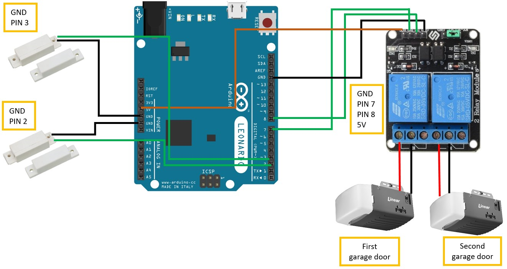

# Domoticz-MQTT-Garge-door-opener

< img src="pictures/Garage_opener_wiring_diagram.png" >
I made a  garge door opener for Domoticz. This project handle two garage doors simultaneously and monitoring the real status of doors with magnetic contact reed switch via MQTT protocol. If you use your own remote controller for the garage door opener the status of the doors will be updated in Domoticz also.

**Components:**

- Arduino Leonardo ETH PoE
- 5V 2 Channel Relay Board Module
- 2 pcs Magnetic Contact Reed Switch

**Domoticz configuration:**

- Add MQTT Client Gateway with LAN interface
- Add Dummy virtual switch
- Create 2 switch for two garage doors (You have to set On and Off Action for the switches)

